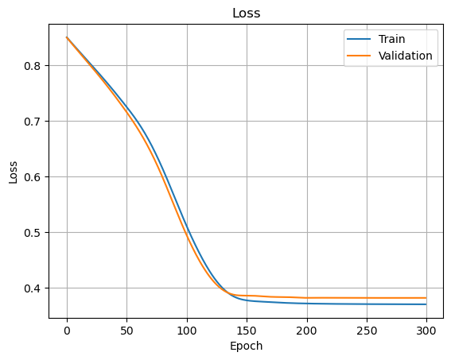
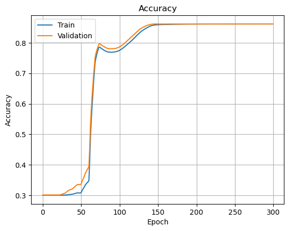
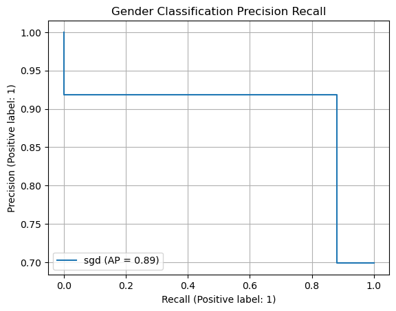
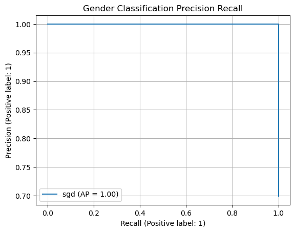

# Gender Classification
This repository serves as an implementation of a gender classification algorithm based on website traffic with ML and DL techniques. The project aims on estimating the gender (m/f) based on web traffic data encompassing the user_id, path_id and the timestamp of website calls. The algorithm is developed based on a dataset consisting of approximately 2.5M website calls of over 13.5k distinct users.

<p align="middle">
    
    
</p>

<p align="center"> Figure 1: Data visualizations of gender-specific call behaviour in the TrainVal dataset over time of day (left) and website path (right). </p>

## Getting started
### Installation

Environments:

- Python 3.8
- PyTorch 2.0.1

Install the package:

```
pip install -r requirements.txt
```

### Data

- Download train and test data [here](https://drive.google.com/drive/folders/1TlMt_qXCLjfiafHna5OYwbGKh611QQKr?usp=sharing)

- Move csv-files to `data/`

- Run [visualization.ipynb](visualization.ipynb) to create a split of train and validation data

### Demo

- Run `main.py`:

```
python main.py
```

- Modify the model and training parameters via command line flags

- Possible parameter flags are provided by running

```
python main.py --help
```

## Results
In this section results of the classifier models on the validation set are presented. Despite achieving the highest accuracy on the training data the Random Forest Classifier reaches the lowest validation performance with an accuracy of 83%. The SGD classifier as well as the neural network achieve a validation accuracy of 86%. However, these results are achieved if each website call is classified individually (see Figure 3, left). If the user voting is applied on top of the independent results the validation accuracy of each classifier is increased to 100% (see Figure 3, right).

<p align="middle">
    
    
</p>

<p align="center"> Figure 2: Loss (left) and accuracy (right) of neural network training. </p>

| Model                    | Train Accuracy | Val Accuracy | Val Accuracy (w/ user voting) |
| ------------------------ | :------------: | :----------: | :---------------------------: |
| Random Forest Classifier | 0.89           | 0.83         | 1.00                          |
| SGD Classifier           | 0.86           | 0.86         | 1.00                          |
| Neural Network           | 0.86           | 0.86         | 1.00                          |

<p align="middle">
    
    
</p>

<p align="center"> Figure 3: Precision-recall curve of SGD classifier without a user voting (left) and with a user voting (right). </p>