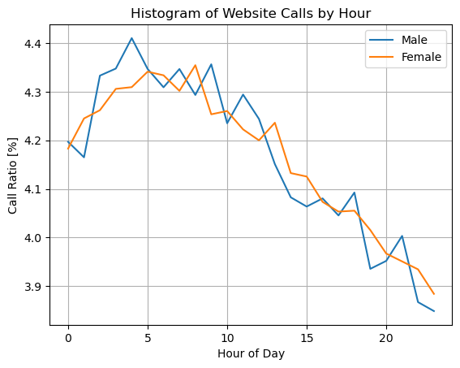
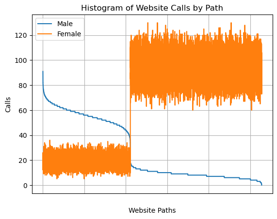

# Gender Classification
This repository serves as an implementation of a gender classification algorithm based on website traffic with ML and DL techniques. The project aims on estimating the gender (m/f) based on web traffic data encompassing the user_id, path_id and the timestamp of website calls. The algorithm is developed based on a dataset consisting of approximately 2.5M website calls of over 13.5k distinct users.

<p align="middle">
    
    
</p>

<p align="center"> Figure 1: Data visualizations of gender-specific behaviour in the TrainVal dataset over call time (left) and website path (right). </p>

## Getting started
### Installation

Environments:

- Python 3.8
- PyTorch 2.0.1

Install the package:

```
pip install -r requirements.txt
```

### Data

- Download train and test data [here](https://drive.google.com/drive/folders/1TlMt_qXCLjfiafHna5OYwbGKh611QQKr?usp=sharing)

- Move csv-files to `data/`

- Run [visualization.ipynb](visualization.ipynb) to create a split of train and validation data

### Demo

- Run `main.py`:

```
python main.py
```

- Modify the model and training parameters via command line flags

- Possible parameter flags are provided by running

```
python main.py --help
```
